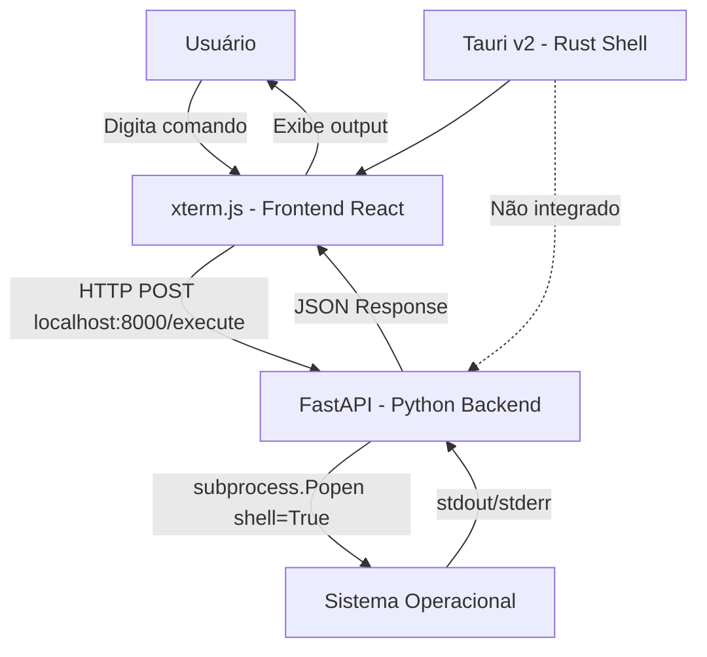
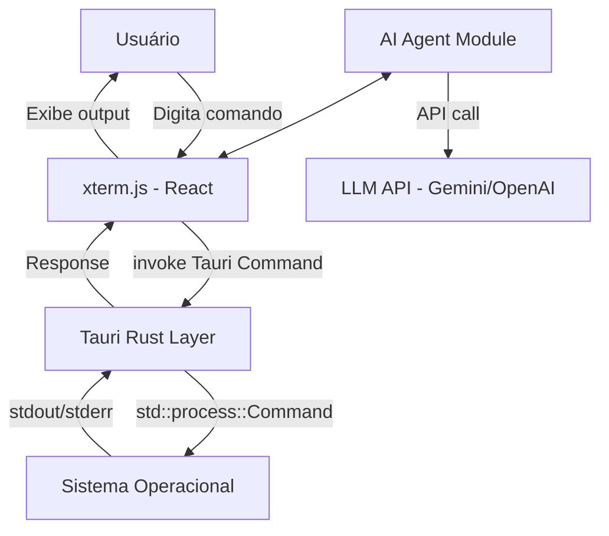
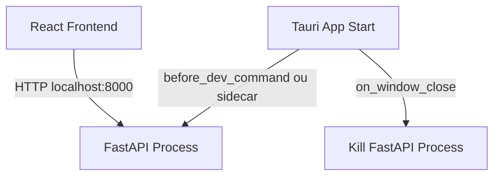

# 📐 Terminal-AI — Análise Arquitetural e Roadmap de Melhorias

## Visão Geral do Projeto

O **Terminal-AI** é uma aplicação desktop construída com **Tauri v2** que embute um terminal interativo (via `xterm.js`) na interface React. A execução dos comandos é delegada a uma **API Python (FastAPI)** rodando localmente em `localhost:8000`.

O projeto tem um conceito interessante: integrar um agente de IA ao terminal. Porém, a implementação atual ainda é um MVP inicial com vários pontos críticos que precisam ser resolvidos antes de qualquer expansão de features.

---

## 🗺️ Arquitetura Atual



### Stack Atual
| Camada | Tecnologia | Versão |
|---|---|---|
| Desktop Shell | Tauri | v2 |
| Frontend | React + TypeScript | 19.x |
| Bundler | Vite | 7.x |
| Terminal UI | xterm.js | 5.3.0 |
| Backend | FastAPI (Python) | - |
| Comunicação | HTTP REST (fetch) | - |
| Nativo (Rust) | Tauri lib | v2 (não usado) |

---

## 🚨 Problemas Críticos Identificados

### 1. Segurança — ALTO RISCO

> [!CAUTION]
> **Injeção de Comandos via Shell**
> O backend usa `subprocess.Popen(cmd, shell=True)` sem nenhuma sanitização de entrada. Qualquer comando digitado pelo usuário é executado diretamente no OS com privilégios do processo Python. Embora seja um terminal local, isso deve ser tratado com cuidado especialmente quando o agente de IA for integrado.

> [!WARNING]
> **CORS Aberto (`allow_origins=["*"]`)**
> A API FastAPI aceita requisições de qualquer origem. Se outra página web aberta no browser do usuário detectar que `localhost:8000` está ativo, ela pode executar comandos arbitrários na máquina do usuário.

### 2. Arquitetura — Dependência HTTP Desnecessária

O frontend React (rodando dentro do Tauri) se comunica com o backend Python via **HTTP puro** (`fetch("http://localhost:8000/...")`). Isso:
- Requer que o processo Python esteja rodando **manualmente** antes da app
- Não há nenhum mecanismo de inicialização automática do backend
- Cria um ponto de falha silencioso (a app abre mas não funciona se Python não estiver rodando)
- Adiciona latência de rede desnecessária para comunicação local

### 3. Estado Global no Backend — Condição de Corrida

O `current_directory` no `main.py` é uma variável global Python. Se múltiplos requests chegarem concorrentemente (improvável mas possível), o estado pode ser corrompido. O FastAPI é assíncrono por padrão mas o estado global não é thread-safe.

### 4. Frontend — Monolito em `App.tsx`

Todo o código está em um único arquivo de 140 linhas que mistura:
- Inicialização do terminal (`useEffect`)
- Lógica de input/output
- Chamadas HTTP ao backend
- Renderização de layout

Isso torna o código difícil de manter e impossível de testar.

### 5. Agente de IA — Não Implementado

O `agent_box` no HTML tem apenas um `<h5>` com texto placeholder e um `<div>` vazio. A feature central do produto não existe ainda.

### 6. CSS — Problemas de Layout

```css
/* PROBLEMA: position:absolute com margin-left hardcoded */
.agent_box {
  position: absolute;
  margin-left: 78%; /* Quebra em telas diferentes */
}
/* align-content: space-between no flex não faz o esperado */
/* flex-direction duplicado no mesmo seletor */
```

---

## 🏗️ Arquitetura Proposta

### Opção A — Integrar Backend ao Tauri (Recomendada)

Em vez de um processo Python separado, mover a execução de comandos para o **Rust via comandos Tauri**. O Tauri tem acesso nativo ao sistema e pode executar subprocessos com muito mais segurança e controle.



**Vantagens:**
- Sem dependência de processo Python externo
- Comunicação via IPC nativa (não HTTP)
- CSP e permissões controladas pelo Tauri
- Distribuição em um único binário

### Opção B — Manter Python com Gerenciamento Automático

Manter o Python mas fazer o Tauri iniciar/parar o processo automaticamente usando o lifecycle de eventos Tauri.



---

## 📂 Estrutura de Arquivos Proposta

```
terminal-ai/
├── src/                          # Frontend React
│   ├── components/
│   │   ├── Terminal/
│   │   │   ├── Terminal.tsx      # Componente xterm.js isolado
│   │   │   ├── Terminal.css
│   │   │   └── useTerminal.ts    # Hook com lógica do terminal
│   │   ├── AgentPanel/
│   │   │   ├── AgentPanel.tsx    # Painel do agente de IA
│   │   │   ├── AgentPanel.css
│   │   │   └── ChatMessage.tsx   # Componente de mensagem
│   │   └── Layout/
│   │       └── AppLayout.tsx     # Layout principal
│   ├── hooks/
│   │   ├── useShell.ts           # Hook de comunicação com shell
│   │   └── useAgent.ts           # Hook do agente de IA
│   ├── services/
│   │   ├── shellService.ts       # Abstração da API de shell
│   │   └── agentService.ts       # Abstração da API de IA
│   ├── types/
│   │   └── index.ts              # Tipos TypeScript compartilhados
│   ├── App.tsx
│   ├── App.css
│   └── main.tsx
├── src-tauri/
│   ├── src/
│   │   ├── main.rs
│   │   ├── lib.rs
│   │   ├── commands/
│   │   │   ├── mod.rs
│   │   │   ├── shell.rs          # Comandos de execução de shell
│   │   │   └── fs.rs             # Comandos de sistema de arquivos
│   │   └── state/
│   │       └── mod.rs            # Estado gerenciado pelo Tauri
│   ├── Cargo.toml
│   └── tauri.conf.json
├── backend/                      # (Opcional - se mantiver Python)
│   ├── main.py
│   ├── requirements.txt          # FALTANDO ATUALMENTE
│   └── .env.example
└── docs/
    └── architecture.md
```

---

## 🔧 Melhorias por Camada

### Frontend (React/TypeScript)

#### 1. Separar o Terminal em Componente Próprio

```typescript
// src/hooks/useTerminal.ts
export function useTerminal(onCommand: (cmd: string) => void) {
  const terminalRef = useRef<HTMLDivElement>(null);
  const termRef = useRef<Terminal | null>(null);
  // ... lógica isolada
  return { terminalRef };
}
```

#### 2. Abstrair Comunicação com Backend

```typescript
// src/services/shellService.ts
export const shellService = {
  getCwd: async (): Promise<string> => { /* ... */ },
  execute: async (cmd: string): Promise<CommandResult> => { /* ... */ },
};
```

#### 3. Tipar Respostas da API

```typescript
// src/types/index.ts
export interface CommandResult {
  output: string;
  error: string;
  cwd: string;
}
```

#### 4. Melhorar o Layout CSS

```css
/* Usar CSS Grid em vez de position:absolute */
.container {
  display: grid;
  grid-template-columns: 1fr 280px; /* Terminal | Agente */
  height: 100vh;
  gap: 0;
}
```

---

### Backend (Python/FastAPI)

#### 1. Adicionar `requirements.txt`

```
fastapi>=0.115.0
uvicorn[standard]>=0.32.0
pydantic>=2.0.0
```

#### 2. Restringir CORS

```python
# Apenas aceitar do origin do Tauri
app.add_middleware(
    CORSMiddleware,
    allow_origins=["http://localhost:1420", "tauri://localhost"],
    allow_methods=["GET", "POST"],
    allow_headers=["Content-Type"],
)
```

#### 3. Eliminar Estado Global com Variáveis de Sessão

```python
# Usar contexto por sessão ou threading.local
from contextvars import ContextVar
current_directory: ContextVar[str] = ContextVar(
    'current_directory', 
    default=os.getcwd()
)
```

#### 4. Adicionar Validação de Comandos

```python
BLOCKED_COMMANDS = ["rm -rf /", "format c:", "del /f /s /q"]

def validate_command(cmd: str) -> bool:
    return not any(blocked in cmd.lower() for blocked in BLOCKED_COMMANDS)
```

---

### Camada Tauri/Rust

#### 1. Implementar Comandos Nativos de Shell

```rust
// src-tauri/src/commands/shell.rs
use std::process::Command;
use std::sync::Mutex;
use tauri::State;

pub struct ShellState {
    pub cwd: Mutex<String>,
}

#[tauri::command]
pub async fn execute_command(
    cmd: String,
    state: State<'_, ShellState>,
) -> Result<CommandResult, String> {
    let cwd = state.cwd.lock().unwrap().clone();
    
    let output = Command::new("cmd")
        .args(["/C", &cmd])
        .current_dir(&cwd)
        .output()
        .map_err(|e| e.to_string())?;
    
    Ok(CommandResult {
        output: String::from_utf8_lossy(&output.stdout).to_string(),
        error: String::from_utf8_lossy(&output.stderr).to_string(),
        cwd,
    })
}
```

#### 2. Registrar Estado e Comandos no Builder

```rust
// src-tauri/src/lib.rs
pub fn run() {
    tauri::Builder::default()
        .manage(ShellState {
            cwd: Mutex::new(std::env::current_dir()
                .unwrap()
                .to_string_lossy()
                .to_string()),
        })
        .invoke_handler(tauri::generate_handler![
            commands::shell::execute_command,
            commands::shell::get_cwd,
            commands::shell::change_directory,
        ])
        .run(tauri::generate_context!())
        .expect("error while running tauri application");
}
```

---

### Agente de IA (Feature Pendente)

#### Proposta de Implementação

```typescript
// src/hooks/useAgent.ts
export function useAgent() {
  const [messages, setMessages] = useState<Message[]>([]);
  const [isLoading, setIsLoading] = useState(false);

  const sendMessage = async (userMessage: string, context?: string) => {
    setIsLoading(true);
    // Enviar histórico de comandos como contexto ao LLM
    const response = await agentService.chat(userMessage, {
      terminalHistory: context,
    });
    setMessages(prev => [...prev, { role: 'assistant', content: response }]);
    setIsLoading(false);
  };

  return { messages, sendMessage, isLoading };
}
```

O painel do agente deve:
- Ter um chat real com histórico
- Receber o contexto do terminal (últimos N comandos)
- Poder sugerir e executar comandos automaticamente
- Usar streaming de resposta para UX fluida

---

## 🎨 Melhorias de Design

### Sistema de Design Proposto

```css
:root {
  /* Cores */
  --bg-primary: #0d1117;
  --bg-surface: #161b22;
  --bg-elevated: #21262d;
  --border-subtle: rgba(255, 255, 255, 0.08);
  --border-default: rgba(255, 255, 255, 0.15);
  
  /* Accent */
  --accent-primary: #58a6ff;
  --accent-success: #3fb950;
  --accent-danger: #f85149;
  --accent-warning: #d29922;
  
  /* Typography */
  --font-ui: 'Inter', system-ui, sans-serif;
  --font-mono: 'JetBrains Mono', 'Cascadia Code', monospace;
  
  /* Spacing */
  --space-xs: 4px;
  --space-sm: 8px;
  --space-md: 16px;
  --space-lg: 24px;
  --space-xl: 32px;
  
  /* Radius */
  --radius-sm: 6px;
  --radius-md: 10px;
  --radius-lg: 16px;
}
```

### Layout com CSS Grid (Corrigido)

```css
.app-layout {
  display: grid;
  grid-template-rows: 36px 1fr; /* Titlebar + Content */
  grid-template-columns: 1fr 300px; /* Terminal + Agent */
  height: 100vh;
  background: var(--bg-primary);
  font-family: var(--font-ui);
}

.titlebar { grid-column: 1 / -1; }
.terminal-area { grid-column: 1; }
.agent-panel { grid-column: 2; border-left: 1px solid var(--border-subtle); }
```

---

## 📋 Roadmap de Implementação

### Fase 1 — Estabilização (Urgente)
- [ ] Adicionar `requirements.txt` ao backend
- [ ] Corrigir CORS para origens específicas
- [ ] Inicialização automática do backend Python via Tauri sidecar
- [ ] Tratamento de erro quando backend não está disponível
- [ ] Corrigir layout CSS (remover `position:absolute` e hardcoded margins)

### Fase 2 — Refatoração de Arquitetura
- [ ] Separar `App.tsx` em componentes (`Terminal`, `AgentPanel`, `AppLayout`)
- [ ] Criar `useTerminal` hook
- [ ] Criar `shellService.ts` com tipos TypeScript
- [ ] Implementar comandos Tauri nativos em Rust (Opção A)
- [ ] Migrar fetch HTTP para `invoke` do Tauri

### Fase 3 — Agente de IA
- [ ] Implementar `AgentPanel` com chat real
- [ ] Criar `useAgent` hook com integração LLM
- [ ] Passar histórico de comandos como contexto ao agente
- [ ] Implementar execução de comandos sugeridos pelo agente
- [ ] Adicionar streaming de respostas

### Fase 4 — Polish e Features
- [ ] Implementar sistema de design com CSS variables
- [ ] Adicionar suporte a múltiplas tabs de terminal
- [ ] Histórico de comandos persistido (up/down arrows)
- [ ] Autocomplete de comandos
- [ ] Configuração de tema pelo usuário
- [ ] Titlebar customizada (remover barra nativa do OS)

---

## ⚠️ Resumo dos Problemas por Prioridade

| Prioridade | Problema | Impacto |
|---|---|---|
| 🔴 Crítico | CORS aberto (`allow_origins=["*"]`) | Segurança |
| 🔴 Crítico | Backend não inicia automaticamente | UX quebrada |
| 🟠 Alto | Estado global não thread-safe no Python | Bugs de estado |
| 🟠 Alto | Todo código em `App.tsx` único | Manutenibilidade |
| 🟡 Médio | Layout CSS com `position:absolute` hardcoded | Layout quebrado |
| 🟡 Médio | Sem `requirements.txt` | Onboarding quebrado |
| 🟡 Médio | Agente de IA não implementado | Feature principal ausente |
| 🟢 Baixo | Sem tipos TypeScript para respostas da API | Qualidade de código |
| 🟢 Baixo | Sem histórico de comandos (seta ↑) | UX |
