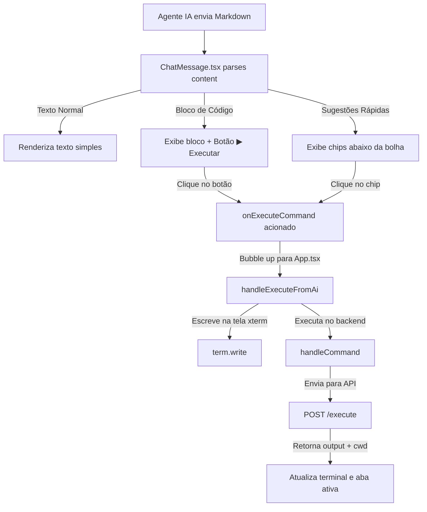

# 🤖 Execução de Comandos via Chat do Agente IA

Este documento explica detalhadamente o funcionamento da caixa de mensagens do Agente IA no **Terminal-AI**, especificamente como o componente de chat renderiza o conteúdo, identifica blocos de código e executa comandos diretamente no terminal ativo.

---

## 📌 Visão Geral do Fluxo

A interação entre o chat do agente e o terminal xterm segue um fluxo de eventos bidirecional e reativo:



---

## 🧩 Os Componentes Envolvidos

### 1. `ChatMessage.tsx` (O Parser de Conteúdo)
Localização: [`src/components/AgentPanel/ChatMessage.tsx`](file:///c:/Users/Ed%20Bm/Desktop/Rotina/termin/terminal-ai/src/components/AgentPanel/ChatMessage.tsx)

Este componente é responsável por exibir cada balão de mensagem. A sua lógica principal consiste em dividir a string da resposta da IA e procurar por blocos de código com a sintaxe Markdown (fenced code blocks: ` ``` `).

#### Lógica de Parsing:
Usamos uma expressão regular para capturar blocos de código:
```typescript
const parts = text.split(/(```[\w]*\n[\s\S]*?```)/g);
```

Para cada bloco encontrado:
- Extraímos a linguagem (ex: `bash`, `powershell`, `python`).
- Isolamos o código real.
- Injetamos o botão **▶ Executar** (`chat-code-run`).

#### Sugestões Rápidas:
O backend extrai comandos sugeridos e envia na propriedade `commands` do JSON de resposta. Estes são renderizados como chips interativos debaixo do balão da mensagem para acesso rápido:
```tsx
{message.commands.slice(0, 3).map((cmd, i) => (
  <button key={i} className="chat-suggestion-chip" onClick={() => onExecuteCommand(cmd)}>
    ▶ {cmd}
  </button>
))}
```

---

## ⚡ Fluxo de Execução Técnica

Quando o utilizador clica em **▶ Executar** num bloco de código ou num chip de sugestão, o seguinte percurso de execução é ativado:

### Passo A: Propagação do Evento (Bubble Up)
O clique dispara a callback `onExecuteCommand(code)` definida nas props. Este evento sobe a árvore de componentes:
```
ChatMessage (clique) ➔ AgentPanel ➔ App.tsx (handleExecuteFromAi)
```

### Passo B: Recepção em `App.tsx`
Localização: [`src/App.tsx`](file:///c:/Users/Ed%20Bm/Desktop/Rotina/termin/terminal-ai/src/App.tsx)

Em `App.tsx`, o manipulador `handleExecuteFromAi` recebe o código limpo:

```typescript
const handleExecuteFromAi = (cmd: string) => {
  const term = termRef.current;
  if (!term) return;
  
  // 1. Escreve visualmente o comando no xterm.js com quebra de linha
  term.write(cmd + "\r\n");
  
  // 2. Dispara a execução real
  handleCommand(cmd);
};
```

### Passo C: Execução real (`handleCommand`)
O método `handleCommand` faz o pedido HTTP para o backend do projeto:

1. **Chamada API**: Faz o POST para o endpoint `/execute` no backend Python:
   ```typescript
   const data = await executeCommand(cmd);
   ```
2. **Buffer de Contexto da IA**: O output do comando é anexado à referência `lastOutputRef.current`. Isto garante que a IA saberá o resultado do último comando no próximo envio:
   ```typescript
   let outputText = "";
   if (data.output) outputText += data.output;
   if (data.error) outputText += data.error;
   lastOutputRef.current = (lastOutputRef.current + "\n" + outputText).slice(-3000);
   ```
3. **Sincronização de Shell e Pasta**: Se o comando alterar o diretório (ex: `cd project`) ou alterar o interpretador (ex: `shell python`), o backend retorna o novo `cwd` e `shell`. O frontend atualiza a aba ativa no gerenciador de abas (`updateTab`):
   ```typescript
   updateTab(activeTabId, {
     shell: updatedShell,
     cwd: data.cwd || "~",
   });
   ```
4. **Escrita no Terminal**: Escreve o output do comando na tela e redesenha o prompt atualizado.

---

## 🛡️ Medidas de Segurança e Usabilidade

> [!IMPORTANT]
> **Por que a execução não é 100% autónoma?**
> Para evitar que a IA execute comandos destrutivos sem a sua autorização (como `rm -rf /` ou formatação de discos), o projeto implementa o **modo sugestão**. O código é gerado pelo assistente, mas requer sempre um clique físico do utilizador no botão "▶ Executar" para iniciar a execução.

> [!TIP]
> **Interrupção de processos lentos**:
> Todos os comandos enviados através do botão do chat passam pelo mesmo pipeline do terminal, o que significa que beneficiam do timeout padrão de 30 segundos implementado no backend para evitar que processos fiquem travados indefinidamente.
